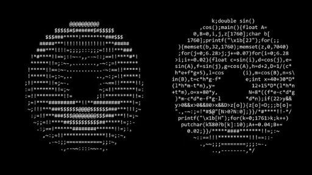

<div align="center">
  <a href="https://golang.org/">
    
  </a>
  <a href="LICENSE">
    
  </a>
</div>

# 🍩 Donut - ASCII Donut Animation in Go

This project is an idiomatic Go implementation that maintains the spirit and logic of the original [donut.c](https://www.a1k0n.net/2006/09/15/obfuscated-c-donut.html), with improvements for Go’s syntax, structure, and best practices. The project delivers the same mesmerizing ASCII donut animation in your terminal, while benefiting from Go’s modern language features and code clarity.

Building upon the original C implementation, this version offers improvements through Go's strong concurrency support and cleaner code structure, while maintaining the same mesmerizing visual effect with no external dependencies.

><center><i>Inspired by <a href="https://www.a1k0n.net/2011/07/20/donut-math.html">Andy Sloane's donut.c math</a>.</i></center>

## How To Run

Run the following to see the donut in action:

```
go run donut.go
```

<div align="center">
  
</div>

### How It Works

- Uses trigonometry and matrix math to project a 3D torus onto a 2D ASCII grid
- Calculates luminance for each point to simulate shading
- Double buffers output for smooth animation
- Tweak animation parameters by editing the constants at the top of `donut.go`

## License

MIT License. See [LICENSE](LICENSE) for details.
